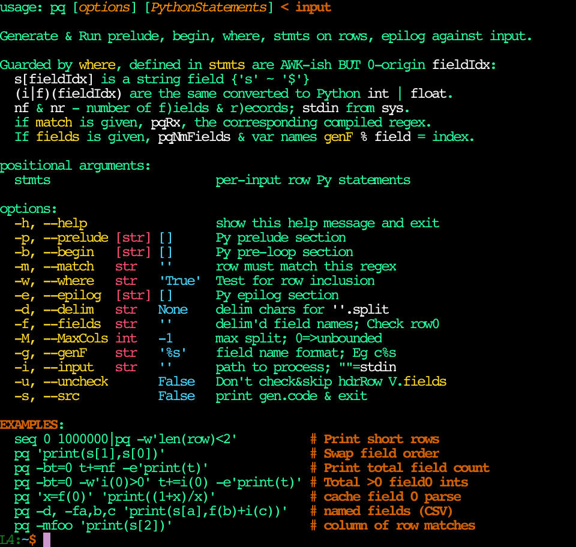

Nim is better than Python in most respects, not delaying many common errors
until run-time and generating fast running native code with powerful abstraction
mechanisms like hygienic templates, syntax macros, user-defined operator
notation and so on.  That said, Python will have a zillion more libraries in it
for the foreseeable future.  For whatever reasons it may not be convenient to
use a Nim `cligen` program to call Python from Nim (the reverse of what
[NimPy](https://github.com/yglukhov/nimpy) provides) to access these libs.

Meanwhile, `cligen` has a nice system for colorizing generated help text & cfg
files for end CLusers to drive such and Python does have the base PLang syntax
and introspective capabilities needed for this low-code CLI framework style[^1].
More than once, I've found myself re-writing things in Nim from Python mostly to
get nicer help formatting.  So, my own _personal_ "convenience" is that I have
many scripts that use them and "re-binding" to some `cg.py` is much less work
than porting these scripts (and all they rely upon) to Nim.

This situation inspired me to write the [`cg.py`](cg.py) included here which can
work off of the same config file setups as `cligen.nim`.  It works under both
Python2 & Python3.  It uses the Python `ast` module to parse both `cligen` and
program config files which is clever & concise, but also means that MANY invalid
config files only fail at run-time.  It supports the same sections & style/color
specification sub-languages that `cligen/humanUt.nim` uses and the basic env.var
`CLIGEN=/dev/null` or `CONFIG_PQ=/my/pq.ini` protocols.[^2]

To make all this more concrete, here is some example output (with my personal
dark background color scheme) from the included demo program [pq](pq) which is
in the same "family" of "prog.languages" that houses awk /
[rp](https://github.com/c-blake/bu/blob/main/doc/rp.md) /
[crp](https://github.com/c-blake/bu/blob/main/doc/crp.md)

The convention there is yellow is for literal option keys (bound to both
`[color].optKeys` & `[render].doubleBQuo`), singleBQuo/white for other literal
Python program text & italics / bold (which my terminal emulator also maps to
light & dark orange) are just kind of stand out comments / optional context with
parameter types in red and defaults in cyan.  You are, of course, free to decide
your own conventions.  It's hard to be quantitative about how much they help,
but these kinds of font/style conventions are pretty common in textbooks,
especially in technical fields, and a help message is in some ways a very terse
textbook / manual.[^3]

[^1]: In fact, as per the [main README](../README.md), `Plac` in June 2010 &
right on its heels `argh` in November 2010 (according to both PyPI release
history and these
[two](https://www.thecodingforums.com/threads/plac-the-easiest-command-line-arguments-parser-in-the-world.724602/)
[URIs](https://www.reddit.com/r/Python/comments/e5nag/argh_a_simple_argparse_wrapper_that_doesnt_make/)
anyway) inspired `cligen.nim`.  The `inspect` module began in January 2001, with
`getargspec`-like ability from the start.  So, there may be 9 year earlier cases
or some other Plang thing.  Happy to give credit where it's due if anyone knows.

[^2]: If this turns out to be popular, I can add a few more things like `$PQ`
and put it on PyPI or some such.

[^3]: In math&physics, folks even switch to Greek & "double struck" Latin fonts
like symbols for sets of numbers, such as complex numbers, ℂ.  That domain has
an adjacency-implies-multiplication syntax choice which to get well-formed
tokenization induces a need for one-letter symbols (& sub/super-scripting which
monospace terminals just do not support as well).
